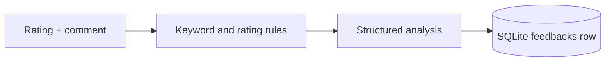

# Analysis Pipeline

The portfolio demo uses a deterministic local analyzer. It does not call any
external LLM provider.

## Output

The analyzer returns:

- sentiment: `positive`, `neutral`, or `negative`
- sentiment score from `-1` to `1`
- themes from the supported taxonomy
- short summary
- suggested next action
- urgency: `low`, `medium`, or `high`

Supported themes:

- `service`
- `price`
- `speed`
- `quality`
- `communication`

## Flow

## Why Local

For a GitHub portfolio project, local analysis has better defaults:

- no API key
- no network dependency
- deterministic tests
- faster local setup
- no accidental sharing of customer text with providers

The interface still keeps analysis behind `createFeedbackAnalyzer()`, so a real
provider could be added later without changing route handlers.
