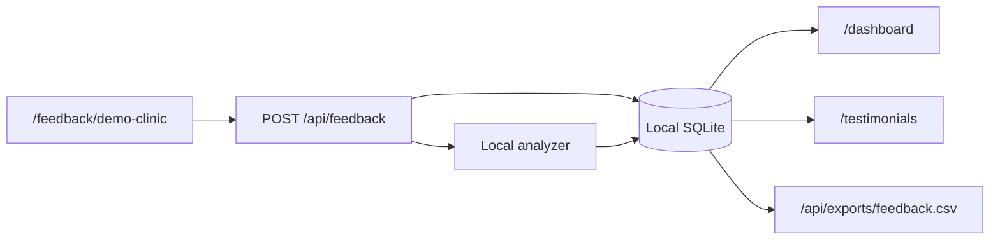

# Architecture

ReviewPulse is a local portfolio demo, not a production SaaS backend. The
architecture favors clarity, fast startup, and a visible end-to-end workflow.

## Components



## Source Layout

```text
src/
├── app/                 # routes, pages, and route handlers
├── components/          # UI components
├── features/            # domain services
├── lib/                 # validation, API envelope, rate limit
└── types/               # shared domain contracts
sqlite/
└── schema.sql           # local database schema
```

## Domain Boundaries

- `features/feedback`: public submission and analysis orchestration.
- `features/dashboard`: dashboard read model.
- `features/demo`: SQLite store, demo context, and seed data.
- `features/exports`: CSV shaping and formula-safe export.
- `features/responses`: response draft generation.
- `features/testimonials`: testimonial approval workflow.

Route handlers stay thin: parse input, validate with Zod, call a service, and
return an envelope.

## Runtime Data

The app writes to `.data/reviewpulse.sqlite` by default. The database is local
only and ignored by git. The schema is applied on first access, then seed rows
are inserted if the database is empty.

## Performance Choices

- No external calls on initial render.
- No auth provider or hosted database.
- Server components render the dashboard read model.
- Client components are limited to forms and action buttons.
- The analyzer is deterministic and local.

## Tradeoffs

SQLite is enough for a portfolio mockup. It does not demonstrate production
multi-tenant auth, hosted backups, or background job processing. Those would add
setup friction without improving the public demo experience.
